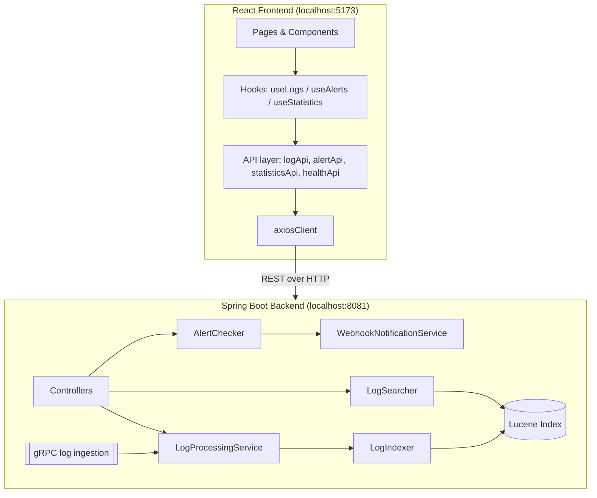

# LogStream

A centralized logging and alerting dashboard. React/TypeScript frontend talking to a real Spring Boot backend — no mock data, no fake API layer.

## Overview

LogStream lets a team ingest logs from multiple services, search them (Lucene-backed full text search), define alert rules that trigger on error-rate thresholds, and receive webhook notifications when a rule fires. This repository is the frontend: a Vite + React + TypeScript app that talks to the Spring Boot backend over REST.

## Architecture



## Tech stack

**Frontend:** React 18, TypeScript, Vite, React Router, Axios, Tailwind CSS, Recharts, Lucide React.

**Backend:** Spring Boot (Java), Lucene for indexing/search, gRPC for log ingestion, an alert engine, webhook notifications.

## Project structure

```
src/
├── api/            axiosClient + one module per resource (logs, alerts, statistics, health)
├── components/      layout, dashboard, logs, alerts, common
├── pages/           one file per route
├── types/           LogEntry, AlertRule, TriggeredAlert, LogStatistics, ...
└── hooks/           useLogs, useAlerts, useStatistics (own the 10s polling)
```

Components never call axios directly — every request goes through the matching `*Api.ts` module, which uses the shared `axiosClient`.

## Frontend setup

```bash
npm install
cp .env.example .env   # adjust VITE_API_BASE_URL if your backend runs elsewhere
npm run dev
```

The app runs at `http://localhost:5173` and expects the backend at `http://localhost:8081` (configurable via `VITE_API_BASE_URL`).

## Backend setup

This frontend expects a Spring Boot service on port `8081`. Two endpoints are already confirmed against the existing backend:

- `POST /api/logs`
- `GET /api/logs/search?keyword={keyword}`

Everything else the UI calls — statistics, recent logs, service list, alerts, alert rules, health — is **not yet confirmed** to exist. The Spring Boot source for all of it is provided separately in `logstream-backend-additions/` (controllers, services, DTOs, exception handling), ready to drop into the existing project under `com.logstream.api`. Each service class contains `TODO(backend)` comments describing exactly how to wire it to the real `LogIndexer`, `LogSearcher`, `AlertChecker`, and `WebhookNotificationService` — the controllers themselves contain no business logic.

Until those are implemented, the corresponding UI sections show an explicit "not implemented" or "unable to load" state rather than fabricated data — the frontend never falls back to mock values.

## Environment variables

| Variable | Description | Default |
|---|---|---|
| `VITE_API_BASE_URL` | Base URL of the Spring Boot backend | `http://localhost:8081` |

## API endpoints used by the frontend

| Method | Path | Status | Used by |
|---|---|---|---|
| POST | `/api/logs` | Confirmed | Ingest Log page |
| GET | `/api/logs/search?keyword=` | Confirmed | Log Explorer, navbar search |
| GET | `/api/logs/statistics` | Needs backend | Dashboard stat cards |
| GET | `/api/logs/statistics/timeline` | Needs backend | Dashboard chart |
| GET | `/api/logs/recent?limit=` | Needs backend | Dashboard recent logs |
| GET | `/api/logs/services` | Needs backend | Services page, Log Explorer filter |
| GET | `/api/alerts` | Needs backend | Alerts page, dashboard, navbar badge |
| GET | `/api/alerts/rules` | Needs backend | Alert Rules page |
| POST | `/api/alerts/rules` | Needs backend | Alert Rules page (create) |
| DELETE | `/api/alerts/rules/{ruleName}` | Needs backend | Alert Rules page (delete) |
| GET | `/api/health` | Needs backend | System Health page, navbar status |

## How to test log ingestion

1. Go to **Ingest Log** (`/ingest`).
2. Fill in Service, Level, and Message (ID, timestamp, and response time are optional).
3. Submit — on success you'll see "Log received successfully"; validation errors from the backend are shown inline per field.

Or via curl:

```bash
curl -X POST http://localhost:8081/api/logs \
  -H "Content-Type: application/json" \
  -d '{"id":"ORDER-001","timestamp":"2026-09-17T11:00:00Z","service":"order-service","level":"ERROR","message":"Order processing failed","responseTime":1500}'
```

## How to test search

1. Go to **Log Explorer** (`/logs`), or use the navbar search box from anywhere.
2. Enter a keyword (e.g. `database`) and optionally filter by service, level, or time range.
3. Results show a count, search duration, and a paginated table with relevance score.

## How to create alert rules

1. Go to **Alert Rules** (`/alert-rules`) → **Create Rule**.
2. Fill in rule name, threshold, window (seconds), service name, level, and notification type.
3. Submit — the rule list refreshes automatically. Delete a rule from the row action; you'll be asked to confirm first.

## How webhook alerts work

1. A rule (e.g. `order-error-rate`: `order-service`, `ERROR`, threshold `5`, window `120s`) is created via **Alert Rules**.
2. Matching logs are ingested (via `POST /api/logs` or gRPC) and indexed by Lucene.
3. `AlertChecker` counts matches for the rule's service/level within its time window.
4. Once the count reaches the threshold, `AlertChecker` records a triggered alert and hands off to `WebhookNotificationService`, which posts to the configured webhook URL.
5. The triggered alert appears on the **Alerts** page and the Dashboard's active-alerts panel within 10 seconds (poll interval), and the navbar shows a notification dot.

## Real-time updates

The Dashboard, Alerts page, and recent-logs table poll every 10 seconds via `setInterval` inside dedicated hooks (`useStatistics`, `useTriggeredAlerts`, `useRecentLogs`), each cleaning up its interval on unmount. This is intentionally simple so it can later be swapped for WebSocket/SSE without touching the components that consume the hooks.
